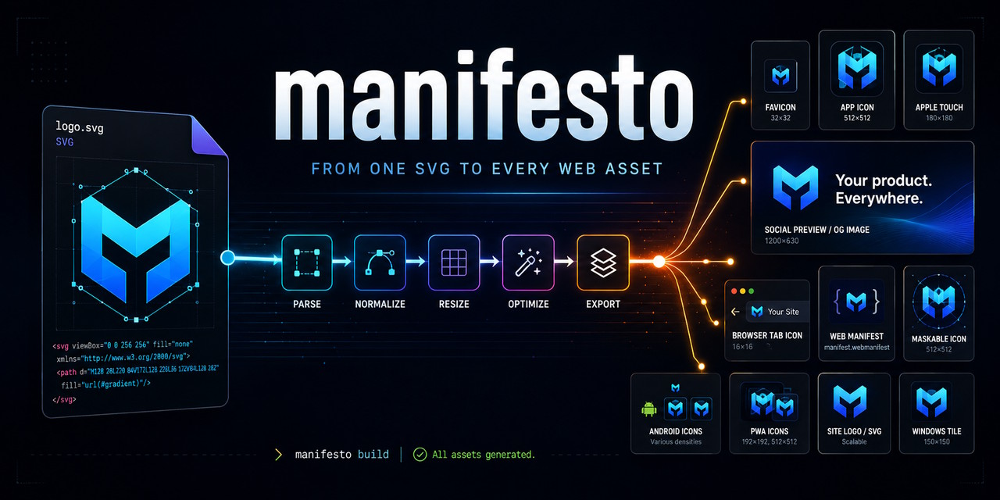

# Manifesto

> Drop an SVG and get every icon asset a website needs.



A Windows desktop app for generating website icons. Drop in an SVG and Manifesto creates
six icon files, a web app manifest, and the four `<head>` tags that reference them. It also
previews each icon at the size used by the target platform.

## Why

Website icons have a few easy-to-miss requirements.

- iOS places transparent touch icons on a black background.
- Android clips maskable icons to a circular safe zone.
- Small favicons lose detail when they are resized from a large raster image.

Manifesto handles these differences when it generates the files. Its previews use the same
bytes written to disk, so they match the final output.

## What you get

```text
acme-logo/
├── favicon.ico            16 · 32 · 48, PNG-embedded
├── favicon.svg            vector; swaps on prefers-color-scheme if you supply a dark logo
├── apple-touch-icon.png   180², always opaque
├── icon-192.png           transparent, purpose "any"
├── icon-512.png           transparent, purpose "any"
├── icon-maskable-512.png  opaque, fitted to the circular Safe Zone
├── site.webmanifest       name, short_name, theme_color, background_color, icons
└── manifesto.json         the settings used, so re-dropping restores them
```

Manifesto also provides the snippet to paste into your `<head>`. It never reads or changes
your HTML.

## Install and run

```sh
bun install
bun run dev
```

| Command | What it does |
| --- | --- |
| `bun run dev` | Builds, checks, and launches the app |
| `bun run dev:watch` | Launches the Electrobun watcher without the bundle check |
| `bun run dist` | Creates an unsigned Windows installer |
| `bun run check` | Runs formatting, linting, type checking, and tests |
| `bun run check:package` | Inspects the packaged payload after `dist` |

## CLI

The CLI runs the same pipeline without opening the app. It uses the same defaults as the
desktop interface, so both produce identical output from the same file.

```sh
bun run cli acme-logo.svg ./public
bun run cli acme-logo.svg --dark acme-dark.svg --bg '#111111'
bun run cli --snippet
```

The CLI writes the same seven Bundle files and `manifesto.json` Sidecar as the app. It does
not replace existing Bundle files unless you pass `--force`. Other files in the output
directory are left alone.

```text
--dark <file.svg>     dark-mode logo, used on dark backgrounds and in favicon.svg
--name <string>       manifest name              (default is inferred from the filename)
--short <string>      manifest short_name        (default is inferred or uses --name)
--theme <#rrggbb>     theme_color                (default is inferred from the artwork)
--bg <#rrggbb>        icon background            (default is inferred by contrast)
--splash <#rrggbb>    manifest background_color  (default is the same as --bg)
--no-optimize         skip SVGO
--force               replace existing Bundle files in the output directory
--snippet             print the <head> snippet and exit
```

Defaults are inferred from rendered pixels rather than SVG markup. This works with
`fill="currentColor"`, CSS variables, symbols, and gradients.

## Docs

| Document | Covers |
| --- | --- |
| [CONTEXT.md](./CONTEXT.md) | Domain vocabulary used in code and commits |
| [PRODUCT.md](./PRODUCT.md) | Audience, product voice, references, and accessibility |
| [DESIGN.md](./DESIGN.md) | Visual tokens, type scale, and design rules |

## Status

Manifesto is feature-complete through the packaged build. Windows is the only tested
platform. Electrobun supports macOS and Linux, but this project has not been tested on
either one. The DPI integration is disabled outside Windows.
