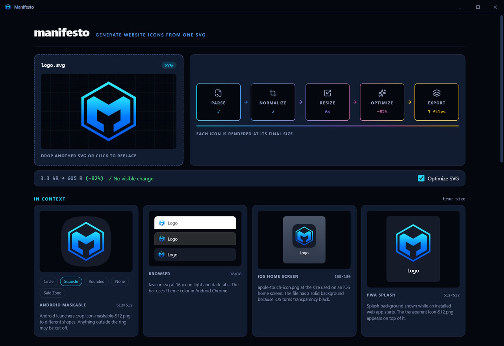

# Manifesto

> Drop an SVG and get every icon asset a website needs.


A Windows desktop app for generating website icons. Drop in an SVG and Manifesto creates
six icon files, a web app manifest, and the four `<head>` tags that reference them. It also
previews each icon at the size used by the target platform.

If your logo uses a single color, Manifesto can paint it for both color schemes from two
colors you pick.

## Why

Website icons have a few easy-to-miss requirements.

- iOS places transparent touch icons on a black background.
- Android clips maskable icons to a circular safe zone.
- Small favicons lose detail when they are resized from a large raster image.

Manifesto handles these differences when it generates the files. Its previews use the same
bytes written to disk, so they match the final output.

## What you get

```text
acme-logo/
├── favicon.ico            16 · 32 · 48, PNG-embedded
├── favicon.svg            vector; swaps on prefers-color-scheme with a second logo
├── apple-touch-icon.png   180², always opaque
├── icon-192.png           transparent, purpose "any"
├── icon-512.png           transparent, purpose "any"
├── icon-maskable-512.png  opaque, fitted to the circular Safe Zone
├── site.webmanifest       name, short_name, theme_color, background_color, icons
└── manifesto.json         the settings used, so re-dropping restores them
```

With two logos, one supplied or two recolored from one, you also get `favicon-light.svg`
and `favicon-dark.svg`. Nothing references them. They are there for the places that do no
scheme switching, such as a README badge or a social profile.

Manifesto also provides the snippet to paste into your `<head>`. It never reads or changes
your HTML.



## Two-color icons

A logo painted in one color can be recolored instead of needing a second file. You pick a
dark-mode logo color and a dark-mode background, and light mode swaps the two.

No PNG format and no manifest field selects an icon by color scheme, so you also pick which
mode the PNG and ICO files use. Those files then become opaque, because a logo painted for
one background is illegible on the other. `favicon.svg` still carries both.

Recoloring stays off until you turn it on, and it is offered only for a logo that uses one
color. A multicolor logo would be flattened to a silhouette, and a logo with a dark-mode
file already has its second version.

## Install and run

```sh
bun install
bun run dev
```

The first build downloads the Electrobun toolchain — Hutch, and the SDK it projects into
`.hutch/` — into a shared store outside the repo. That step needs network access; later
builds do not.

| Command | What it does |
| --- | --- |
| `bun run dev` | Builds, checks, and launches the app |
| `bun run dev:watch` | Launches the Electrobun watcher without the bundle check |
| `bun run dist` | Creates an unsigned Windows installer — run it from PowerShell, not Git Bash |
| `bun run check` | Runs formatting, linting, type checking, and tests |
| `bun run check:package` | Inspects the packaged payload after `dist` |

## Releases

Commits on `main` use the Conventional Commits format. Release Please maintains a release
pull request containing the next version and changelog. Merging that pull request creates a
draft GitHub release, builds and checks the Windows installer, attaches the files from
`artifacts/`, and publishes the release. The initial release is `0.1.0`.

Use `feat:` for user-facing additions and `fix:` for corrections. Other commit types do not
normally cause a version release by themselves.

## CLI

The CLI runs the same pipeline without opening the app. It uses the same defaults as the
desktop interface, so both produce identical output from the same file.

```sh
bun run cli acme-logo.svg ./public
bun run cli acme-logo.svg --dark acme-dark.svg --bg '#111111'
bun run cli acme-logo.svg --recolor '#F4F6F8' --recolor-bg '#101418' --primary dark
bun run cli --snippet
```

The CLI writes the same seven Bundle files and `manifesto.json` Sidecar as the app, plus
the two single-scheme SVGs when a second logo exists. It does not replace existing Bundle
files unless you pass `--force`. Other files in the output directory are left alone.

```text
--dark <file.svg>       dark-mode logo, used on dark backgrounds and in favicon.svg
--name <string>         manifest name              (default is inferred from the filename)
--short <string>        manifest short_name        (default is inferred or uses --name)
--theme <#rrggbb>       theme_color                (default is inferred from the artwork)
--bg <#rrggbb>          icon background            (default is inferred by contrast)
--splash <#rrggbb>      manifest background_color  (default is the same as --bg)
--recolor <#rrggbb>     dark-mode color for a logo that uses one color
--recolor-bg <#rrggbb>  dark-mode background       (light mode swaps the two)
--primary <light|dark>  mode the PNG and ICO files use   (default is light)
--no-optimize           skip SVGO
--force                 replace existing Bundle files in the output directory
--snippet               print the <head> snippet and exit
```

Defaults are inferred from rendered pixels rather than SVG markup. This works with
`fill="currentColor"`, CSS variables, symbols, and gradients.

## Docs

| Document | Covers |
| --- | --- |
| [CONTEXT.md](./CONTEXT.md) | Domain vocabulary used in code and commits |
| [PRODUCT.md](./PRODUCT.md) | Audience, product voice, references, and accessibility |
| [DESIGN.md](./DESIGN.md) | Visual tokens, type scale, and design rules |
| [docs/adr/](./docs/adr/) | Decisions and the options weighed against them |

## Status

Manifesto is feature-complete through the packaged build. Windows is the only tested
platform. Electrobun supports macOS and Linux, but this project has not been tested on
either one. The DPI integration is disabled outside Windows.
